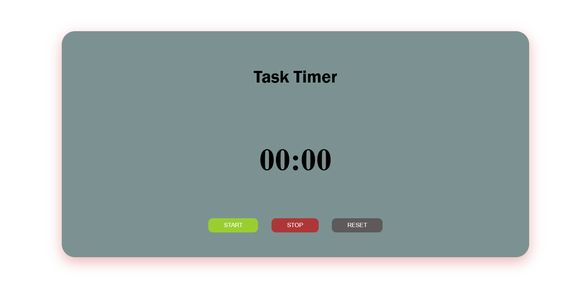

# ⏱️ Task Timer

A simple and clean web-based timer to help users stay focused and manage tasks effectively.

---

## 🚀 Features

* ⏳ Start, Stop, and Reset timer
* 🎯 Simple and user-friendly interface
* ⚡ Fast and lightweight
* 📱 Responsive design

---

## 🛠️ Technologies Used

* HTML5
* CSS3
* JavaScript

---

## 📸 Screenshot



---

## 📂 Project Structure

```
task-timer/
 ├── index.html
 ├── style.css
 ├── script.js
 └── screenshot.png
```

---

## ▶️ How to Run

1. Clone this repository:

```
git clone https://github.com/your-username/task-timer.git
```

2. Open the project folder

3. Run `index.html` in your browser

---

## 🎯 Future Improvements

* 🔔 Add alarm sound
* ⏲️ Custom time settings
* 🌙 Dark mode
* 📊 Task/session tracking

---

## 👤 Author

* Ty Visal

---

## ⭐ Support

If you like this project, please give it a ⭐ on GitHub!
